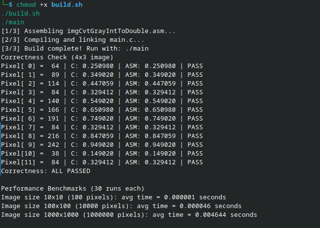

# lbyarch-x86-to-C_interface
LBYARCH Machine Project - Grayscale Int-to-Double Converter

## Group Members - S25E
* Neil Jr. Gutang
* Allisha Kate Wong

## Project Description
This project implements a hybrid C and x86-64 assembly program to convert grayscale images represented as 8-bit unsigned integers (0-255) to a double precision floating-point representation (0.0 to 1.0). The C program handles memory allocation, correctness checking, benchmarking, and result output, while the core conversion calculation `imgCvtGrayIntToDouble()` is performed in x86-64 NASM assembly utilizing functional scalar SIMD registers and instructions.

## How to Build & Run
A build script is provided to simplify compilation and linking. 

```bash
chmod +x build.sh
./build.sh
./main
```

## Performance Benchmarks
The program runs the conversion algorithm 30 times for different image sizes to calculate the average execution time.

| Image Size | Total Pixels | Average Execution Time (seconds) |
| --- | --- | --- |
| 10 x 10 | 100 | 0.000001 |
| 100 x 100 | 10,000 | 0.000046 |
| 1000 x 1000 | 1,000,000 | 0.004665 |

### Performance Analysis
The execution time scales linearly with the number of pixels. Processing 10,000 pixels takes roughly 46x longer than 100 pixels, and processing 1,000,000 pixels takes roughly 100x longer than 10,000 pixels. The performance of the x86-64 assembly implementation using SIMD scalar instructions is highly optimized, completing the largest array conversion in under 5 milliseconds on average.

## Output and Correctness


## Demo Video
[YouTube Demo Video](https://youtu.be/3Lelhl8bni4)
